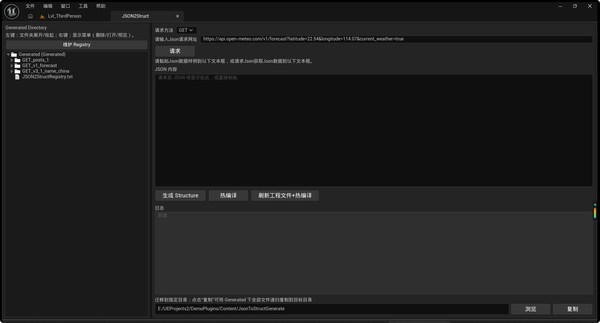

# JSON2Struct使用说明

> 联系方式（WeChat）：`wujifeng_mr` / Contact (WeChat): `wujifeng_mr`

`JSON2Struct` 是一个 Unreal Engine 插件，用于将 JSON（包含 HTTP 返回）快速生成并映射为 `UStruct`，降低 REST API 接入成本。

> 本仓库文档按“插件独立提交”设计，提交范围仅为 `Plugins/JSON2Struct`。
> 许可：MIT，可免费商用（含闭源）。/ License: MIT, free for commercial use (including closed-source).

## 适用范围

- Unreal Engine `5.1.1 - 5.7.4`

## 插件结构

- `Source/JSON2StructEditor`：编辑器模块（面板、生成流程、交互）
- `Source/JSON2StructRuntime`：运行时模块（请求、解析、蓝图库、Generated）
- `ARCHITECTURE.md`：插件模块设计说明
- `JSON2Struct.uplugin`：插件描述文件

## 环境要求

- Windows 10/11（当前项目主要在 Windows 环境维护）

## 在项目中使用

1. 将 `JSON2Struct` 文件夹放入项目 `Plugins/` 目录
2. 确认插件 `JSON2Struct` 已启用
3. 在编辑器工具栏打开 `JSON2Struct` 面板
4. 输入接口 URL 或粘贴 JSON，执行生成

## 生成代码位置

默认输出目录：

`Source/JSON2StructRuntime/Public/Generated/`

## 开发约定

- C++ 代码遵循 UE 模块结构（`Public/` + `Private/`）
- 编辑器能力仅放在 `JSON2StructEditor`
- 运行时能力仅放在 `JSON2StructRuntime`

## 贡献

欢迎通过 Issue / Pull Request 反馈问题与提交改进，提交前请先阅读 `CONTRIBUTING.md`。  
PR 建议仅包含插件目录改动（`Plugins/JSON2Struct`）。

## 安全问题

如果发现安全相关问题，请参考 `SECURITY.md`。

## 许可证

本插件采用 MIT 许可证，详见 `LICENSE`。

